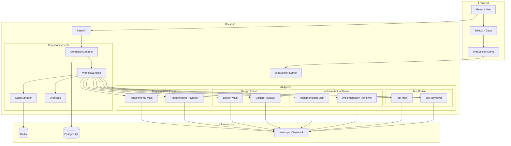
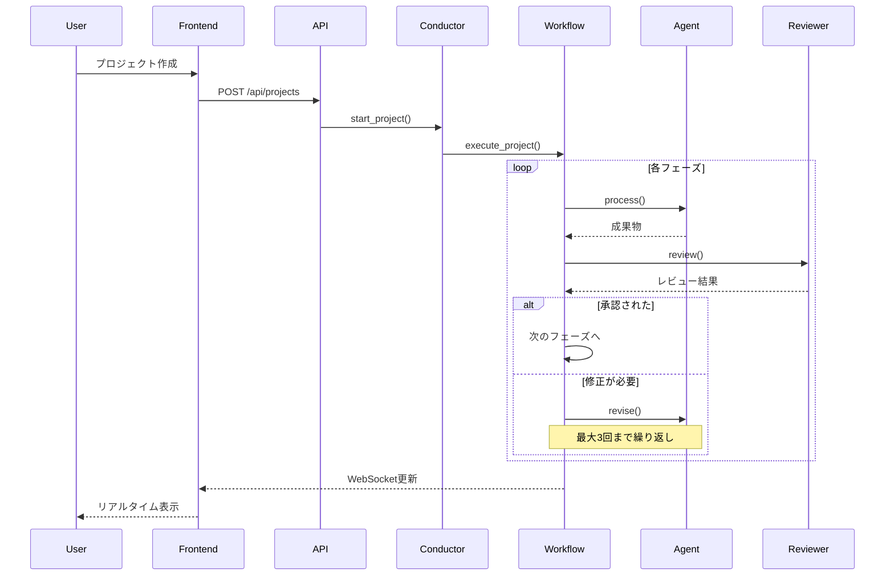

# マルチエージェント開発システム

AIエージェントが協調して動作する自動ソフトウェア開発システムです。要件定義から実装、テストまでの開発プロセスを4つのフェーズに分け、各フェーズで専門のAIエージェントが作業を行い、レビュアーエージェントが品質を保証します。

## 🚀 特徴

- **4フェーズの開発プロセス**: 要件定義 → 設計 → 実装 → テスト
- **8つのAIエージェント**: 各フェーズにメインエージェントとレビュアーエージェント
- **品質保証**: 各フェーズで最大3回のレビューイテレーション
- **リアルタイム監視**: WebSocketによる進捗のリアルタイム確認
- **人間の介入**: いつでも一時停止・再開・方向修正が可能
- **永続的な状態管理**: Redisによるプロジェクト状態の管理

## 🏗️ アーキテクチャ

### システム構成図



### ワークフロー図



### バックエンド

- **FastAPI**: REST APIとWebSocketエンドポイント
- **Redis**: プロジェクト状態の管理
- **PostgreSQL**: 永続的なデータストレージ
- **Anthropic Claude 3 Sonnet**: 全エージェントのLLMとして使用
- **LangChain**: LLMの統合とチェーン管理

### フロントエンド

- **React + TypeScript**: UIフレームワーク
- **Vite**: 高速な開発サーバーとビルドツール
- **Radix UI**: アクセシブルなUIコンポーネント
- **Redux + Redux-Saga**: 状態管理
- **CSS Modules**: スコープ付きスタイリング

## 📦 プロジェクト構成

```
multi-agent-dev-system/
├── backend/
│   ├── app/
│   │   ├── agents/          # AIエージェント実装
│   │   ├── api/             # APIルート
│   │   ├── core/            # コアロジック（ワークフロー、状態管理）
│   │   └── main.py          # FastAPIアプリケーション
│   ├── tests/               # pytestテストスイート
│   └── requirements.txt
├── frontend/
│   ├── src/
│   │   ├── components/      # Reactコンポーネント
│   │   ├── store/           # Redux store
│   │   └── contexts/        # React contexts
│   └── package.json
├── docker-compose.yml
└── Makefile
```

## 🛠️ セットアップ

### 前提条件

- Docker & Docker Compose
- Anthropic APIキー

### 環境変数の設定

`.env`ファイルを作成し、以下の内容を設定：

```env
ANTHROPIC_API_KEY=your_api_key_here
```

### 起動方法

```bash
# 全サービスの起動
make up

# または
docker compose up -d
```

## 🖥️ 使い方

1. ブラウザで http://localhost:3000 にアクセス
2. 「Start New Project」をクリック
3. プロジェクト名と要件を入力
4. AIエージェントが自動的に開発プロセスを開始
5. Activity Streamでリアルタイムの進捗を確認

## 🤖 AIエージェント

### フェーズ1: 要件定義

- **RequirementsMainAgent**: ユーザー要件を分析し、詳細な要件定義書を作成
- **RequirementsReviewAgent**: 要件の完全性と実現可能性をレビュー

### フェーズ2: 設計

- **DesignMainAgent**: システムアーキテクチャとデータ設計を作成
- **DesignReviewAgent**: 設計の技術的妥当性をレビュー

### フェーズ3: 実装

- **ImplementationMainAgent**: 設計に基づいてコードを生成
- **ImplementationReviewAgent**: コード品質とベストプラクティスをレビュー

### フェーズ4: テスト

- **TestMainAgent**: 包括的なテストスイートを作成
- **TestReviewAgent**: テストカバレッジと品質をレビュー

## 🔧 API エンドポイント

### プロジェクト管理

- `POST /api/projects` - 新規プロジェクト作成
- `GET /api/projects` - プロジェクト一覧取得
- `GET /api/projects/{id}` - プロジェクト詳細取得
- `POST /api/projects/{id}/pause` - プロジェクト一時停止
- `POST /api/projects/{id}/resume` - プロジェクト再開

### WebSocket

- `ws://localhost:8000/api/ws/{project_id}` - リアルタイム更新

## 🧪 テスト

```bash
# バックエンドテストの実行
cd backend
docker compose exec backend python -m pytest

# または
make test
```

## 📝 開発

### バックエンドの開発

```bash
# ホットリロード有効でバックエンドを起動
docker compose up backend
```

### フロントエンドの開発

```bash
# Vite開発サーバーで起動
docker compose up frontend
```

## 🚧 今後の改善点

- [ ] エージェントの並列実行
- [ ] より詳細なエラーハンドリング
- [ ] プロジェクトのエクスポート機能
- [ ] 複数LLMプロバイダーのサポート
- [ ] カスタムエージェントの追加機能

## 📄 ライセンス

このプロジェクトはMITライセンスの下で公開されています。

## 🤝 貢献

プルリクエストを歓迎します。大きな変更の場合は、まずissueを作成して変更内容について議論してください。

## 👥 作成者

Prototype Cafe LLC

---

🤖 Generated with [Claude Code](https://claude.ai/code)

Co-Authored-By: Claude <noreply@anthropic.com>