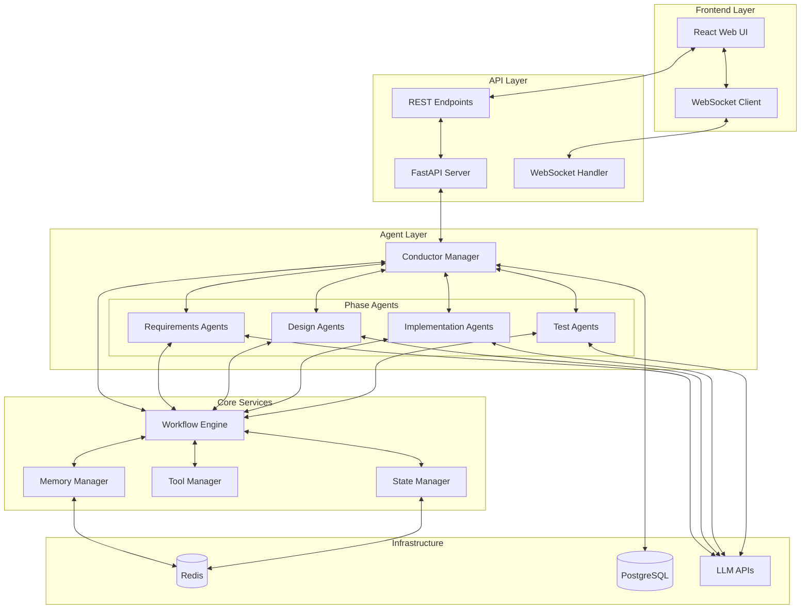
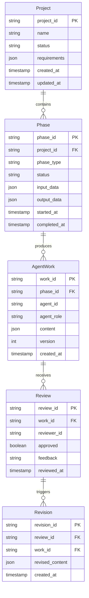
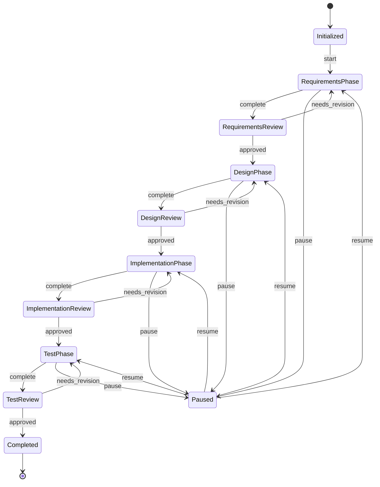

# マルチAIエージェント開発システム - 設計書

## 1. システムアーキテクチャ

### 1.1 全体構成図



### 1.2 コンポーネント設計

#### 1.2.1 Conductor Manager
```python
class ConductorManager:
    """全体のオーケストレーションを管理"""
    - workflow_engine: WorkflowEngine
    - agent_registry: Dict[str, BaseAgent]
    - state_manager: StateManager
    - event_bus: EventBus
    
    + start_project(requirements: str) -> str
    + pause_workflow(project_id: str) -> bool
    + resume_workflow(project_id: str, direction: Dict) -> bool
    + get_status(project_id: str) -> ProjectStatus
```

#### 1.2.2 Base Agent
```python
class BaseAgent(ABC):
    """全エージェントの基底クラス"""
    - llm: BaseLLM
    - tools: List[BaseTool]
    - memory: BaseMemory
    - role: AgentRole
    
    + process(input_data: Dict) -> AgentOutput
    + review(work_product: Dict) -> ReviewResult
    + revise(original: Dict, feedback: str) -> Dict
```

#### 1.2.3 Workflow Engine
```python
class WorkflowEngine:
    """ワークフローの実行管理"""
    - phases: List[Phase]
    - current_phase: Phase
    - transition_rules: Dict
    
    + execute_phase(phase: Phase) -> PhaseResult
    + transition_to_next() -> bool
    + validate_transition() -> bool
```

## 2. データモデル

### 2.1 ER図



### 2.2 状態遷移図



## 3. API設計

### 3.1 REST API

#### プロジェクト管理
```yaml
POST /api/projects
  Request:
    {
      "name": "string",
      "requirements": "string",
      "config": {
        "llm_model": "gpt-4",
        "temperature": 0.7
      }
    }
  Response:
    {
      "project_id": "uuid",
      "status": "initialized"
    }

GET /api/projects/{project_id}
  Response:
    {
      "project_id": "uuid",
      "name": "string",
      "status": "string",
      "current_phase": "string",
      "progress": 0-100
    }

POST /api/projects/{project_id}/pause
POST /api/projects/{project_id}/resume
  Request:
    {
      "direction": {...}  # Optional
    }
```

### 3.2 WebSocket API

#### 接続とサブスクリプション
```javascript
// 接続
ws://localhost:8000/ws/{project_id}

// メッセージタイプ
{
  "type": "agent_output",
  "data": {
    "agent_id": "requirements_main",
    "content": "要件分析を開始します...",
    "timestamp": "2024-01-20T10:00:00Z"
  }
}

{
  "type": "phase_transition",
  "data": {
    "from": "requirements",
    "to": "design",
    "timestamp": "2024-01-20T10:30:00Z"
  }
}

{
  "type": "review_feedback",
  "data": {
    "reviewer_id": "requirements_reviewer",
    "approved": false,
    "feedback": "ユーザーストーリーの詳細が不足しています",
    "timestamp": "2024-01-20T10:15:00Z"
  }
}
```

## 4. エージェント詳細設計

### 4.1 要件定義エージェント

#### 主担当エージェント
```python
class RequirementsMainAgent(BaseAgent):
    tools = [
        "user_story_generator",
        "requirement_analyzer",
        "scope_definer",
        "acceptance_criteria_builder"
    ]
    
    prompt_template = """
    あなたは要件定義のスペシャリストです。
    以下の入力を基に、明確で実装可能な要件定義書を作成してください。
    
    入力: {input}
    
    要件定義書には以下を含めてください：
    1. 機能要件
    2. 非機能要件
    3. ユーザーストーリー
    4. 受入基準
    5. スコープと制約
    """
```

#### レビュー担当エージェント
```python
class RequirementsReviewAgent(BaseAgent):
    tools = [
        "completeness_checker",
        "ambiguity_detector",
        "feasibility_analyzer"
    ]
    
    review_criteria = {
        "completeness": "すべての必要な要素が含まれているか",
        "clarity": "曖昧な表現がないか",
        "feasibility": "技術的に実現可能か",
        "testability": "テスト可能な形で定義されているか"
    }
```

### 4.2 設計エージェント

#### 主担当エージェント
```python
class DesignMainAgent(BaseAgent):
    tools = [
        "architecture_designer",
        "component_definer",
        "interface_designer",
        "data_model_creator"
    ]
    
    outputs = {
        "architecture_diagram": "mermaid",
        "component_specs": "json",
        "api_design": "openapi",
        "data_model": "sql/nosql"
    }
```

### 4.3 実装エージェント

#### 主担当エージェント
```python
class ImplementationMainAgent(BaseAgent):
    tools = [
        "code_generator",
        "dependency_manager",
        "code_formatter",
        "documentation_generator"
    ]
    
    supported_languages = ["python", "typescript", "java"]
```

### 4.4 テストエージェント

#### 主担当エージェント
```python
class TestMainAgent(BaseAgent):
    tools = [
        "test_case_generator",
        "test_runner",
        "coverage_analyzer",
        "bug_reporter"
    ]
    
    test_types = ["unit", "integration", "e2e"]
```

## 5. UI設計

### 5.1 画面構成

#### メインダッシュボード
```
+------------------------------------------+
|  Project: AI Development System          |
|  Status: Design Phase (60% complete)     |
+------------------------------------------+
| Requirements | Design | Impl | Test      |
|     ✓       |   ▶    |  ○   |  ○       |
+------------------------------------------+
| Current Activity                         |
| +--------------------------------------+ |
| | Design Agent: Creating architecture  | |
| | diagram for microservices...         | |
| |                                      | |
| | Reviewer: Checking design against    | |
| | requirements...                      | |
| +--------------------------------------+ |
+------------------------------------------+
| Controls                                 |
| [Pause] [Add Direction] [View Details]   |
+------------------------------------------+
```

### 5.2 コンポーネント構造

```typescript
// Main Components
- ProjectDashboard
  - PhaseProgress
  - ActivityStream
    - AgentMessage
    - ReviewFeedback
  - ControlPanel
    - PauseResumeButton
    - DirectionInput
  - ArtifactViewer
    - RequirementsView
    - DesignView
    - CodeView
    - TestResultsView
```

## 6. セキュリティ設計

### 6.1 認証・認可
- JWT基づいた認証
- プロジェクト単位のアクセス制御
- APIキーの暗号化保存

### 6.2 通信セキュリティ
- HTTPS/WSSの使用
- CORSの適切な設定
- Rate Limiting

## 7. エラーハンドリング

### 7.1 エラー分類
1. **LLM関連エラー**
   - API制限
   - タイムアウト
   - 不正なレスポンス

2. **システムエラー**
   - メモリ不足
   - ネットワークエラー
   - データベースエラー

3. **ビジネスロジックエラー**
   - 無限ループ検出
   - 不正な状態遷移
   - データ不整合

### 7.2 リトライ戦略
- Exponential Backoff
- Circuit Breaker Pattern
- Dead Letter Queue